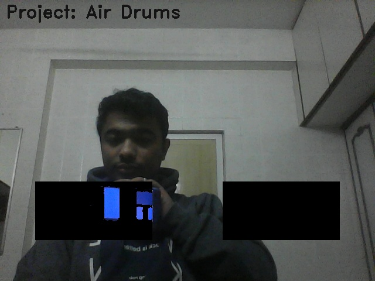
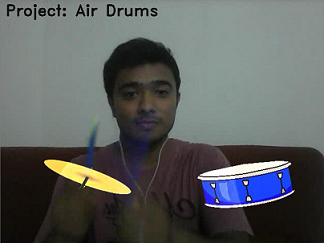

# AIR_Drums Project Tutorial

This tutorial aims at explaining some key concepts of `image processing` using `opencv` with python.
We will try to understand each line of the [code](Air_Drums.py)

###### Note for someone using python for the first time
> anything written after '#' will be treated as a comment 
> it is a good practice to add comments in your code. It makes 
> the code more readable

---
#### Importing all the required libraries 
```python

# Importing the libraries 
from collections import deque
import numpy as np
import time
import cv2
from pygame import mixer

````

####  Initializing variables and creating objects

```python

Verbsoe = True

# importing the audio files
mixer.init()
drum_clap = mixer.Sound('batterrm.wav')
drum_snare = mixer.Sound('button-2.ogg')

```

Here `verbose` is a boolean that you can set to visualise the processing 
in the ROI (Reggion of interest)

verbose = True | with verbose = False
--- | ---
 | 


#### Setting the HSV color range to detect blue color

```python

# HSV range for detecting blue color 
blueLower = (80,150,50)
blueUpper = (120,255,255)
```
With the above lines we set the values to detect the blue color. 
These values will be used in the [creating mask](# creating mask ) to find 
`pixels corresponding to blue color inside the ROI.`


#### Capturing frames from camera and determining the frame size. 

```python
# Frame accusition from webcam/ usbcamera 
camera = cv2.VideoCapture(0)
ret,frame = camera.read()

# Determining the frame resolution (height,width)
H,W = frame.shape[:2]
```

#### Reading the images of instruments to be augmented with fixed size (200,100)

```python
# reading the image of hatt and snare for augmentation.
Hatt = cv2.resize(cv2.imread('Hatt.png'),(200,100),interpolation=cv2.INTER_CUBIC)
Snare = cv2.resize(cv2.imread('Snare.png'),(200,100),interpolation=cv2.INTER_CUBIC)
```
> to read an image the syntax is cv2.imread("path of the image")
> to reshape the image as per desired shape we use cv2.resize(image,(width,heigh),interpolation=INTERPOLATION_METHOD_FLAG_VALUE)
The size for augmenting the objects is decided based on the ROI.


#### Setting the ROI (Region of interest)
The region of interest is the black colour portion in the image below


**Why ROI is needed ?**
> Answer is **Speed**
>To detect blue color we need to perform certain operations on each captured frame. 
>`These operations need some computations to be performed by the processor`.
>Since our instruments are fixed in this application and we want to play the sound only 
>if the blue color object hits the instrument (`detected inside the ROI`) it is a good idea
>to perform all these operation only inside the ROI. 

```python
# Setting the ROI area for blue color detection
Hatt_center = [np.shape(frame)[1]*2//8,np.shape(frame)[0]*6//8]
Snare_center = [np.shape(frame)[1]*6//8,np.shape(frame)[0]*6//8]
Hatt_thickness = [200,100]
Hatt_top = [Hatt_center[0]-Hatt_thickness[0]//2,Hatt_center[1]-Hatt_thickness[1]//2]
Hatt_btm = [Hatt_center[0]+Hatt_thickness[0]//2,Hatt_center[1]+Hatt_thickness[1]//2]

Snare_thickness = [200,100]
Snare_top = [Snare_center[0]-Snare_thickness[0]//2,Snare_center[1]-Snare_thickness[1]//2]
Snare_btm = [Snare_center[0]+Snare_thickness[0]//2,Snare_center[1]+Snare_thickness[1]//2]
```

ROI is selected by indexing the rows and columns of the image frame.
```python img[a:b,c:d] ```


