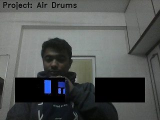

# AIR_Drums Project Tutorial

This tutorial aims at explaining some key concepts of `image processing` using `opencv` with python.

We will try to understand each line of the [code](Air_Drums.py)


---
#### Importing all the required libraries 
```python

# Importing the libraries 
from collections import deque
import numpy as np
import time
import cv2
from pygame import mixer

````

####  Initializing variables and creating objects

```python

Verbsoe = True

# importing the audio files
mixer.init()
drum_clap = mixer.Sound('batterrm.wav')
drum_snare = mixer.Sound('button-2.ogg')

```

Here `verbose` is a boolean that you can set to visualise the processing 
in the ROI (Reggion of interest)

verbose = True | with verbose = False
--- | ---
 | 
